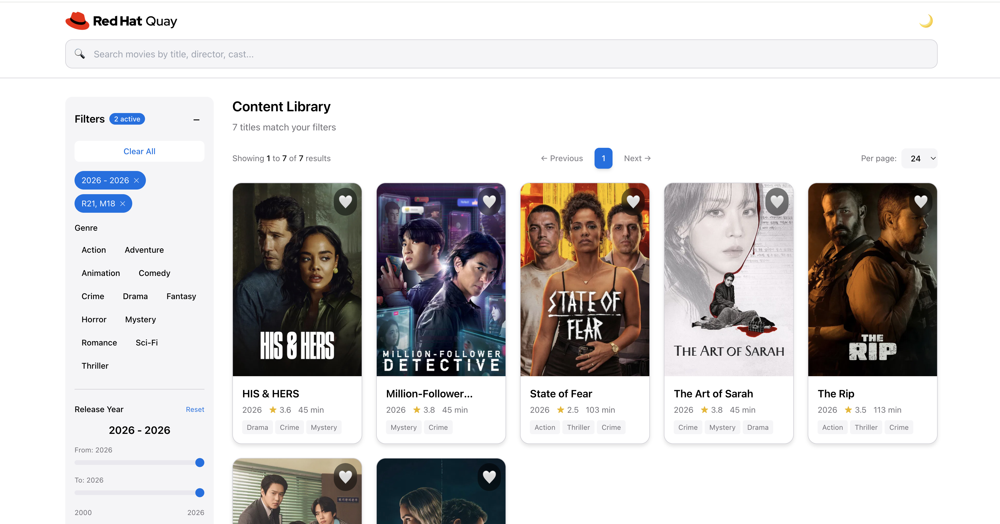

# Netflix Movie Dashboard - Red Hat Quay Entertainment

A modern, elegant dashboard application for browsing and discovering Netflix Singapore content with advanced search, filtering, and pagination features. Built with React, TypeScript, and designed with Apple.com-inspired aesthetics and Red Hat Quay branding.

## 📸 Application Preview



*The Netflix Movie Dashboard in action: Showing the latest 2026 releases with smart sorting (newest first), active content rating filters (R21, M18), advanced filtering sidebar, and elegant Apple.com-inspired dark design with Red Hat Quay branding. Features include search bar, genre filters, year range slider, pagination controls, and movie cards with ratings and favorites.*

## 🎯 Features

### Core Functionality
- **Netflix Singapore Content Library**: Browse 395+ Netflix movies and series from 2000-2026
  - **Smart Sorting**: Latest movies appear first (newest to oldest by default)
  - Page 1 shows the most recent releases (2026, 2025, 2024...)
  - Last pages show older classics (2000-2003)
- **Smart Search**: Fuzzy search powered by Fuse.js for finding content by title, cast, or description
- **Advanced Filtering**:
  - Genre filtering (Action, Comedy, Drama, Thriller, Horror, and more)
  - Content rating filtering (G, PG, PG13, NC16, M18, R21) based on Singapore film classification
  - Year range filtering
  - IMDB rating filtering
  - Runtime filtering
- **Favorites System**: Mark and manage your favorite movies and series
- **Movie Detail Modal**: Click any movie to view detailed information
  - Full movie synopsis and description
  - Cast, director, runtime, and content rating
  - Genre tags and star ratings
  - Direct Netflix URL link with "Watch on Netflix" button
  - Elegant dark modal with smooth animations
  - Close with Escape key or click outside
- **Optimized Pagination**: Browse content with 8 items per page by default (all visible without scrolling)
  - Customizable options: 8, 16, 24, or 40 items per page
  - Responsive grid: 4 columns on desktop, 3 on tablet, 2 on mobile
- **Responsive Design**: Optimized for desktop and mobile viewing

### User Experience
- **Apple.com Design Aesthetic**: Clean, modern interface with smooth animations
- **Dark Mode**: Pure black (#000000) background with elegant typography
- **SF Pro Fonts**: Premium typography matching Apple's design language
- **Smooth Animations**: Powered by Framer Motion for delightful interactions
- **No Scrolling Required**: All images on each page visible at once for better browsing
- **Accessibility**: Keyboard shortcuts (Cmd/Ctrl+K for search)

### Technical Highlights
- **Real-time Updates**: Instant search results with debounced input
- **State Management**: Zustand for efficient state handling
- **Type Safety**: Full TypeScript coverage
- **Performance**: Optimized rendering with React 18 features
- **Data Source**: TMDB (The Movie Database) API for legitimate Netflix content

## 🛠️ Tech Stack

### Frontend
- **React 18.2** - Modern UI framework
- **TypeScript 5.3** - Type-safe development
- **Vite 5.4** - Lightning-fast build tool
- **Tailwind CSS 3.4** - Utility-first CSS framework

### State Management
- **Zustand 4.5** - Lightweight state management
  - `MovieStore` - Movie data and loading states
  - `SearchStore` - Search and filter logic
  - `UIStore` - UI preferences
  - `FavoritesStore` - Favorite movies management

### Search & Filtering
- **Fuse.js 7.1** - Fuzzy search library
- **Custom filter logic** - Multi-criteria filtering system

### Animations
- **Framer Motion 11.0** - Production-ready animation library

### Data Source
- **TMDB API** - Legitimate source for Netflix content metadata
- **Environment Variables** - Secure API key management

### Development Tools
- **ESLint** - Code linting
- **Prettier** - Code formatting
- **Husky** - Git hooks
- **Jest** - Unit testing
- **TypeScript** - Static type checking

## 📦 Installation

### Prerequisites
- Node.js 18+ or 20+
- npm (comes with Node.js)
- TMDB API key (get one at https://www.themoviedb.org/settings/api)

### Setup

1. **Clone the repository**:
```bash
git clone https://github.com/LiZhang19817/spec-kit-demo.git
cd spec-kit-demo/dashboard-demo
```

2. **Install dependencies**:
```bash
npm install
```

3. **Configure TMDB API**:
Create a `.env` file in the project root:
```env
VITE_TMDB_API_KEY=your_tmdb_api_key_here
```

4. **Fetch Netflix content** (optional - data already included):
```bash
node scripts/fetch-netflix-content.js
```

5. **Start development server**:
```bash
npm run dev
```

The application will open at `http://localhost:5174/`

## 🚀 Usage

### Development Commands

```bash
# Start development server
npm run dev

# Build for production
npm run build

# Preview production build
npm run preview

# Run tests
npm test

# Lint code
npm run lint

# Format code
npm run format

# Type check
npm run typecheck
```

### Keyboard Shortcuts

- **Cmd/Ctrl + K**: Focus search input
- **Escape**: Clear search, close filter panel, or close movie detail modal

### Search & Filter

1. **Search**: Type in the search bar to find movies by title, cast, or description
2. **Genre Filter**: Click genre pills to filter by one or more genres
3. **Content Rating**: Select ratings (G, PG, PG13, NC16, M18, R21) to filter content
4. **Year Range**: Use sliders to filter by release year
5. **IMDB Rating**: Filter by minimum IMDB rating
6. **Runtime**: Filter by movie/series duration
7. **Favorites**: Toggle the favorites filter to see only your favorite content

### Movie Details

Click on any movie poster or card to view detailed information:

1. **Movie Information**: Full synopsis, cast, director, runtime
2. **Ratings**: Star rating display and content rating badge
3. **Genres**: All genre tags for the movie
4. **Netflix Link**: Click "Watch on Netflix" button to search for the title on Netflix
5. **URL Display**: Full Netflix search URL shown below the button
6. **Close Modal**: Press Escape key, click the X button, or click outside the modal

### Pagination & Sorting

- **Smart Default Sort**: Movies sorted by release year (newest first)
  - Page 1: Latest releases (2026, 2025, 2024...)
  - Last page: Older classics (2003, 2002, 2001, 2000)
- **Optimized Display**: Default 8 items per page (2 rows of 4 on desktop) - all visible without scrolling
- **Items per page options**: Select 8, 16, 24, or 40 items per page
- **Navigation**: Use Previous/Next buttons or click page numbers
- **Results counter**: Shows current range (e.g., "Showing 1 to 8 of 395 results")
- **Responsive grid**: Automatically adjusts columns based on screen size (4 columns desktop, 3 tablet, 2 mobile)

## 🎨 Design System

### Colors
- **Background**: Pure Black (#000000)
- **Text Primary**: White (#FFFFFF)
- **Text Secondary**: Gray (#9CA3AF)
- **Accent**: Red Hat Red (#EE0000)
- **Surface**: Dark Gray (#1C1C1E)

### Typography
- **Font Family**: SF Pro Display, SF Pro Text
- **Headings**: SF Pro Display (semibold)
- **Body**: SF Pro Text (regular)

### Content Ratings (Singapore Film Classification)

| Rating | Description | Audience |
|--------|-------------|----------|
| **G** | General | Suitable for all ages |
| **PG** | Parental Guidance | Suitable for all but parents should guide young children |
| **PG13** | Parental Guidance 13 | Suitable for 13 and above but parental guidance advised for children below 13 |
| **NC16** | No Children Under 16 | Suitable for 16 and above |
| **M18** | Mature 18 | Suitable for 18 and above |
| **R21** | Restricted 21 | Suitable for 21 and above |

## 📁 Project Structure

```
dashboard-demo/
├── public/
│   ├── assets/
│   │   └── redhat-quay-logo.png
│   ├── data/
│   │   └── movies.json              # Netflix Singapore content (395 titles)
│   └── manifest.json
├── scripts/
│   └── fetch-netflix-content.js     # TMDB API data fetcher
├── src/
│   ├── components/
│   │   ├── common/
│   │   │   ├── EmptyState.tsx
│   │   │   ├── ErrorBoundary.tsx
│   │   │   └── Pagination.tsx       # Pagination controls
│   │   ├── filters/
│   │   │   ├── ContentRatingFilter.tsx  # Singapore rating filter
│   │   │   ├── FilterPanel.tsx
│   │   │   ├── GenreFilter.tsx
│   │   │   └── YearRangeSlider.tsx
│   │   ├── layout/
│   │   │   ├── Header.tsx           # Red Hat Quay branding
│   │   │   └── Layout.tsx
│   │   └── movie/
│   │       ├── MovieCard.tsx
│   │       └── MovieGrid.tsx
│   ├── hooks/
│   │   ├── useKeyboardShortcuts.ts
│   │   ├── useMovieFilter.ts
│   │   ├── useMovieSearch.ts
│   │   └── usePagination.ts         # Pagination logic
│   ├── store/
│   │   ├── favoritesStore.ts
│   │   ├── movieStore.ts
│   │   ├── searchStore.ts
│   │   └── uiStore.ts
│   ├── styles/
│   │   └── globals.css
│   ├── types/
│   │   ├── filters.ts
│   │   └── movie.ts
│   ├── App.tsx
│   └── main.tsx
├── .env.example
├── package.json
├── tailwind.config.js
├── tsconfig.json
└── vite.config.ts
```

## 🔧 Configuration

### Environment Variables

Create a `.env` file:
```env
VITE_TMDB_API_KEY=your_tmdb_api_key_here
```

### TMDB API Configuration

The application uses TMDB API to fetch Netflix content. To get an API key:

1. Create account at https://www.themoviedb.org/
2. Go to Settings → API
3. Request an API key (free for non-commercial use)
4. Copy the API key to `.env` file

### Content Rating Logic

Content ratings are assigned based on:
- **Genre analysis**: Horror → M18/R21, Thriller → M18/NC16, Action → PG13
- **TMDB ratings**: Higher ratings (7.5+) → more restrictive classifications
- **Content description**: Keyword analysis for mature themes

## 📊 Data

### Netflix Content (395 Titles)

- **Source**: TMDB API with Netflix Singapore provider filter
- **Time Range**: 2000-2026
- **Content Types**: Movies and TV Series
- **All titles include**:
  - High-quality poster images
  - Content rating (Singapore classification)
  - Genres, cast, release year
  - IMDB rating, runtime
  - Plot summary

### Content Rating Distribution

| Rating | Count | Percentage |
|--------|-------|------------|
| PG | 122 | 30.9% |
| G | 81 | 20.5% |
| M18 | 79 | 20.0% |
| NC16 | 76 | 19.2% |
| PG13 | 34 | 8.6% |
| R21 | 3 | 0.8% |

## 🎯 How This Project Was Created with Spec-Kit

This project was built using **Spec-Kit**, a powerful specification-driven development framework that helps create high-quality applications through structured planning and implementation.

### What is Spec-Kit?

Spec-Kit is a development methodology that emphasizes:
- **Specification-first approach**: Write detailed specs before coding
- **Structured planning**: Break down features into actionable tasks
- **Constitution-driven development**: Define project principles and standards
- **Quality checklists**: Ensure completeness at every stage

### Development Workflow

#### 1. **Feature Specification** (`/speckit.specify`)

Created the initial specification document:
```bash
/speckit.specify Build a dashboard application with the best user experience
to display my netflix movies and help search find my favourite movies
```

This generated:
- `specs/001-netflix-movie-dashboard/spec.md` - Complete feature specification
- User scenarios and acceptance criteria
- Success metrics and requirements
- Scope boundaries and constraints

#### 2. **Implementation Planning** (`/speckit.plan`)

Enhanced the specification with:
```bash
/speckit.plan the application should be the user experience
like the style of apple.com
```

This created:
- `specs/001-netflix-movie-dashboard/plan.md` - Technical implementation plan
- Technology stack selection (React, TypeScript, Vite, Zustand)
- Architecture decisions and file structure
- Data model and component hierarchy
- Design system specification

#### 3. **Task Breakdown** (`/speckit.tasks`)

Generated actionable tasks:
```bash
/speckit.tasks
```

This produced:
- `specs/001-netflix-movie-dashboard/tasks.md` - Complete task list
- 50+ tasks organized by phase (Setup, Core, Features, Polish)
- Dependency management and parallel execution markers
- File-specific implementation guidance

#### 4. **Project Constitution** (`/speckit.constitution`)

Defined project principles:
```bash
/speckit.constitution Create principles focused on code quality,
testing standards, user experience consistency, and performance requirements
```

This established:
- `.specify/memory/constitution.md` - Project constitution
- Code quality standards
- Testing requirements
- UX consistency principles
- Performance benchmarks

#### 5. **Quality Checklists** (`/speckit.checklist`)

Created validation checklists:
- `specs/001-netflix-movie-dashboard/checklists/requirements.md` - Spec quality
- `specs/001-netflix-movie-dashboard/checklists/ux.md` - User experience
- `specs/001-netflix-movie-dashboard/checklists/test.md` - Testing coverage

#### 6. **Implementation** (`/speckit.implement`)

Executed the implementation:
```bash
/speckit.implement
```

This automated:
- Phase-by-phase task execution
- Dependency-aware task ordering
- Progress tracking with task completion markers
- Validation checkpoints after each phase

### Key Spec-Kit Features Used

#### **Constitution-Driven Development**
- Defined project principles for code quality, UX consistency, and performance
- All implementation decisions validated against constitution
- Automatic template synchronization across specs, plans, and tasks

#### **Checklist Validation**
- Requirements checklist ensured spec completeness before planning
- UX checklist validated design consistency throughout implementation
- Test checklist confirmed coverage and quality standards

#### **Task Organization**
- Tasks organized by user story and priority
- Clear dependency management (sequential vs. parallel tasks)
- File-specific implementation guidance in each task

#### **Incremental Delivery**
- Phase 1: Project setup and data model
- Phase 2: Core UI components and layout
- Phase 3: Search and filtering functionality
- Phase 4: Favorites and pagination
- Phase 5: Polish and optimization

### Benefits of Spec-Kit Approach

1. **Clear Requirements**: Detailed specs prevented scope creep and ambiguity
2. **Structured Planning**: Technical plan ensured consistent architecture
3. **Quality Assurance**: Checklists caught issues early in development
4. **Efficient Execution**: Task breakdown enabled focused implementation
5. **Documentation**: Comprehensive specs serve as project documentation
6. **Maintainability**: Clear structure makes future changes easier

### Spec-Kit Resources

- **Specification**: `specs/001-netflix-movie-dashboard/spec.md`
- **Implementation Plan**: `specs/001-netflix-movie-dashboard/plan.md`
- **Task List**: `specs/001-netflix-movie-dashboard/tasks.md`
- **Constitution**: `.specify/memory/constitution.md`
- **Checklists**: `specs/001-netflix-movie-dashboard/checklists/`

To learn more about Spec-Kit, see the `.specify/` directory for templates and scripts.

## 🐛 Known Issues & Fixes

### Fixed Issues

1. **Infinite Loop in useEffect** ✅
   - **Issue**: Maximum update depth exceeded
   - **Cause**: useEffect dependencies included full Zustand store objects
   - **Fix**: Changed to primitive dependencies (movies.length)

2. **React Hooks Error** ✅
   - **Issue**: "Rendered fewer hooks than expected"
   - **Cause**: Hooks called after early return statements
   - **Fix**: Moved all hooks before conditional returns

3. **Old Data Showing** ✅
   - **Issue**: Application showed 47 old titles instead of 395
   - **Cause**: Script saved to src/data/ but app loads from public/data/
   - **Fix**: Updated script to write to both locations

## 🤝 Contributing

Contributions are welcome! Please feel free to submit a Pull Request.

### Development Guidelines

1. Follow the existing code style (Prettier + ESLint)
2. Write TypeScript with strict type checking
3. Add tests for new features
4. Update documentation as needed
5. Ensure all builds pass before submitting PR

## 📄 License

This project is created for demonstration purposes.

## 🙏 Acknowledgments

- **TMDB** - For providing the Netflix content API
- **Red Hat** - For the Quay branding and logo
- **Apple** - For design inspiration
- **React Team** - For the amazing framework
- **Zustand** - For elegant state management
- **Spec-Kit** - For structured development methodology

## 📞 Contact

**Developer**: Li Zhang
**GitHub**: https://github.com/LiZhang19817
**Repository**: https://github.com/LiZhang19817/spec-kit-demo

---

**Built with ❤️ using React, TypeScript, and Spec-Kit methodology**

**Powered by Red Hat Quay Entertainment**
