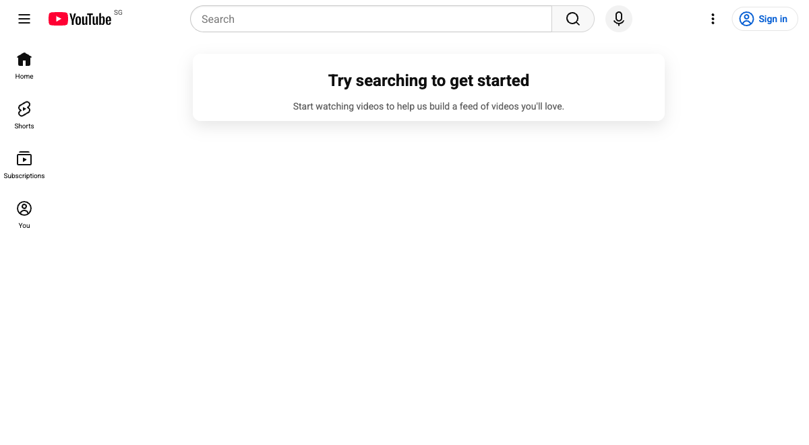

# Netflix & Max Movie Dashboard — Red Hat Quay Entertainment

A React + TypeScript dashboard for browsing **Netflix** and **Max (HBO Max)** movies and series from a shared TMDB-backed catalog. The UI uses Apple-inspired layout, Red Hat Quay branding, **English / 简体中文** i18n, and separate catalog views so titles are not mixed between services.

## Application preview

<p align="center">
  
</p>

**Screenshot** ([`public/assets/application-preview.png`](public/assets/application-preview.png)) — Main library view with **Browse → Netflix** and **Browse → Max (HBO Max)** tabs, left-hand filters (genres, Singapore content ratings, release year, rating), search, **Update** / theme / language controls, and the poster grid with favorites. The same layout is used on both catalog routes; only titles for the selected service are listed.

## Current status (2026)

| Area | Status |
|------|--------|
| **Catalog split** | Routes `/netflix` and `/max` (default `/` → `/netflix`). Search and filters apply **per catalog** (scoped index). Titles available on **both** services appear on **both** tabs. |
| **Watch links** | Modal resolves **Netflix** vs **Max** from `watchProviders` and stored URLs. Max search uses **`https://play.max.com/search?...`** (legacy `www.max.com/search` is normalized client-side). |
| **Data** | Static JSON: `public/data/movies.json` and `src/data/movies.json`. Generated by `scripts/fetch-netflix-content.js` (TMDB discover by provider + region). |
| **i18n** | `en` and `zh-CN` via header toggle; TMDB Chinese titles where available. |
| **Dev import** | Optional `VITE_ENABLE_IMPORT_API=true` + **Update** in header runs catalog refresh in dev (see below). |
| **Quality gates** | `npm run ci` → lint, `typecheck` (app `src` via `tsconfig.build.json`), test, build. Husky runs lint, Prettier check, and typecheck on commit. |

## Features

### Catalog & navigation

- **Separate Netflix and Max pages** — Browse and filter each service’s titles without mixing them.
- **React Router** — Client routes `/netflix`, `/max`; for **static hosting**, configure the server to serve `index.html` for all paths (SPA fallback) so deep links work.
- **TMDB metadata** — Posters, overview, cast, director/creator, runtime, Singapore-style content ratings (heuristic from genres/TMDB score), `watchProviders` (`netflix`, `max`).

### Search & filters

- **Fuzzy search** (Fuse.js) on the **current catalog** slice (title, cast, description, etc.).
- **Filters** — Genres, Singapore content rating (G–R21), release year range, star rating, favorites-only (and optional runtime where enabled).

### Detail & watch

- **Detail modal** — Synopsis, cast, director, ratings, genres.
- **Watch actions** — “Watch on Netflix” / “在 Netflix 观看” or “Watch on Max” / “在 Max 观看” with the correct search URL; when a title is on **both** services, a secondary Max link is shown when data allows.

### UX

- Apple-style layout, dark theme, Framer Motion / GSAP where used.
- **Accessibility** — e.g. Cmd/Ctrl+K focuses search.
- **Catalog update banner** — Optional diff summary after reload when the list changes.
- **Pagination** — Configurable page size (e.g. 8 / 16 / 24 / 40).

## Tech stack

- **React 18**, **TypeScript**, **Vite 5**, **Tailwind CSS 3**
- **react-router-dom** — SPA routing
- **Zustand** — `movieStore`, `searchStore`, `uiStore`, `favoritesStore`, `tmdbZhStore`, etc.
- **Fuse.js** — Fuzzy search
- **Jest** + Testing Library — Unit/integration tests
- **ESLint**, **Prettier**, **Husky**

## Installation

### Prerequisites

- Node.js 18+ or 20+
- npm
- TMDB API key: [themoviedb.org/settings/api](https://www.themoviedb.org/settings/api)

### Setup

1. **Clone**

```bash
git clone https://github.com/LiZhang19817/spec-kit-demo.git
cd spec-kit-demo
```

2. **Install**

```bash
npm install
```

3. **Environment**

Create `.env` in the project root:

```env
VITE_TMDB_API_KEY=your_tmdb_api_key_here
```

4. **Optional: regenerate catalog**

Shipped JSON is already included. To refresh from TMDB (long-running, many API calls):

```bash
npm run fetch:movies
```

The script uses `TMDB_WATCH_REGION` (default **SG**), year range, and provider IDs (default **Netflix `8`** and **Max `1899`**). See comments in `scripts/fetch-netflix-content.js` for env vars.

**Why no auto-download in the browser?** Production loads static `movies.json`. Full TMDB import runs in **Node** with your API key. In **development** only, you can set `VITE_ENABLE_IMPORT_API=true` and use **Update** in the header to POST to `/api/refresh-catalog` (Vite dev plugin), then reload data.

5. **Run dev server**

```bash
npm run dev
```

Default URL: `http://localhost:5173/` (see `vite.config.ts` if the port differs).

## Scripts

```bash
npm run dev          # Dev server
npm run build        # Production build (tsc + vite)
npm run preview      # Preview production build
npm test             # Jest
npm run lint         # ESLint
npm run format       # Prettier (src)
npm run typecheck    # tsc for app sources (tsconfig.build.json)
npm run ci           # lint + typecheck + test + build
npm run fetch:movies # TMDB → movies.json
```

## Keyboard shortcuts

- **Cmd/Ctrl + K** — Focus search
- **Escape** — Close modal / clear focus as implemented in UI

## Configuration notes

- **`TMDB_WATCH_REGION`** — ISO country for discover/watch availability (default `SG`). Max/Netflix catalogs vary by region.
- **Static deployment** — Configure host (e.g. Netlify `_redirects`, nginx `try_files`) so `/netflix`, `/max`, etc. serve `index.html`.

## Project structure (high level)

```
spec-kit-demo/
├── public/data/movies.json          # Loaded at runtime
├── scripts/fetch-netflix-content.js # TMDB catalog import
├── src/
│   ├── App.tsx                      # Router, load catalog
│   ├── components/
│   │   ├── catalog/                 # Browse page, banners, import overlay
│   │   ├── filters/
│   │   ├── layout/                  # Header, Layout, StreamingCatalogNav
│   │   └── movie/
│   ├── context/StreamingCatalogContext.tsx
│   ├── hooks/
│   ├── i18n/
│   ├── lib/                         # fuzzySearch, streamingWatch, catalogDiff, …
│   ├── store/
│   └── types/
├── tests/
├── vite.config.ts
└── vite-plugin-refresh-catalog.ts   # Dev-only refresh API (when enabled)
```

## Data & ratings

- **Source** — TMDB discover + details; watch providers merged per title.
- **Singapore-style ratings** — Heuristic mapping from genres and TMDB vote average (not official IMDA certification).

## Spec-Kit workflow

This repo was bootstrapped with **Spec-Kit** (specify → plan → tasks → implement). See `specs/001-netflix-movie-dashboard/` and `.specify/` for specifications, plans, and checklists.

## Contributing

1. Follow ESLint + Prettier (`npm run lint`, `npm run format:check`).
2. Prefer `npm run typecheck` before push (app sources).
3. Add or update tests for behavioral changes.
4. Pre-commit runs lint, Prettier check, and typecheck.

## License & acknowledgments

Demonstration project.

- **TMDB** — Metadata and images (see TMDB attribution terms).
- **Red Hat** — Quay branding.
- **React, Vite, Zustand, and open-source contributors**

**Repository:** [github.com/LiZhang19817/spec-kit-demo](https://github.com/LiZhang19817/spec-kit-demo)

---

**Built with React, TypeScript, and Spec-Kit-style planning — Red Hat Quay Entertainment**
